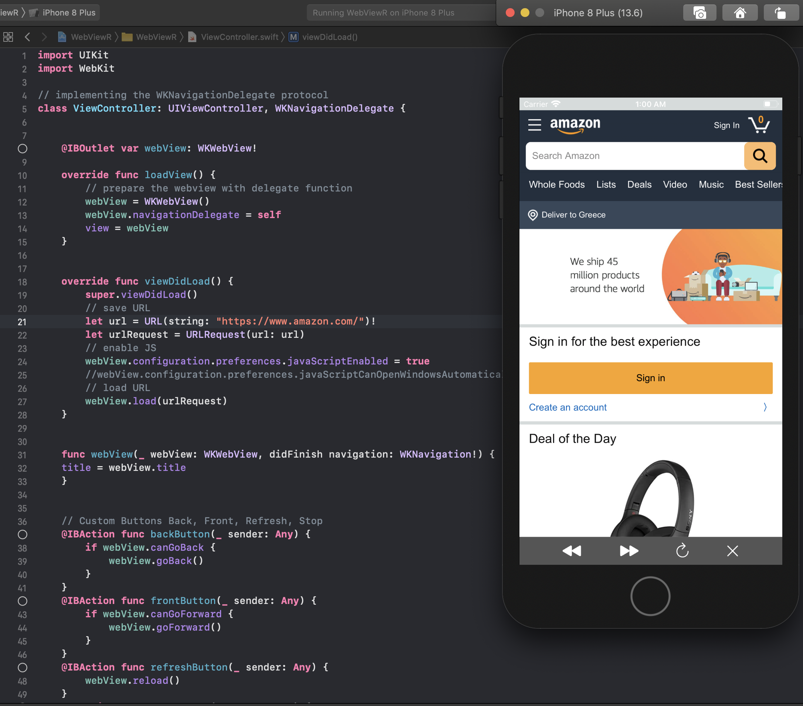

# iOS Web View Project

This repo contains the code for the Web View project, based on Swift. 
* This program helps you explore any website you want with you iOS device. 
  * To do that you can write the full address in the file path WebViewR/WebViewR/ViewController.swift and in line 28 change the url string.

*  It has 4 basic buttons for handling basic events: 
  * Go-Back, 
  * Go-Ftont, 
  * Refesh-Page  
  * Stop-Loading   


## Cloning

```
git clone https://github.com/vatsilidis/iOS-Web-View-.git
```


## Dependencies for Running Locally
* xCode >= 11
* iOS device 12+  


## Compiling and Running

### Compiling
To compile the project, clone it. unzip the file and import it to xCode app.


### Running
* To run the project, insert the website lnk that you want at line 28.
* Then press compile or cmd+R and it will run in the Code virtual device or in your device if connected with USB cable.

If you want to disable Javascript support, go to this path project WebViewR/WebViewR/ViewController.swift to line 31 and change the attribute to be equals to false.


## Contributors
* [Lampros Vatsilidis](https://www.linkedin.com/in/lampros-vatsilidis-5666ba128/)
